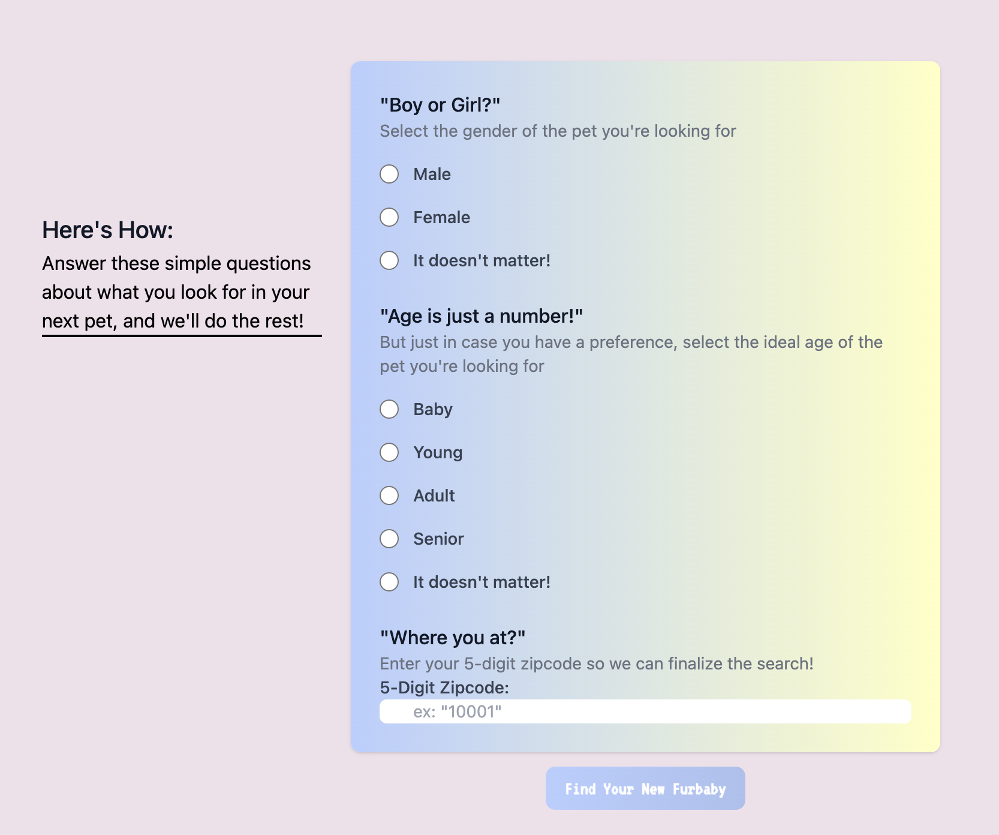
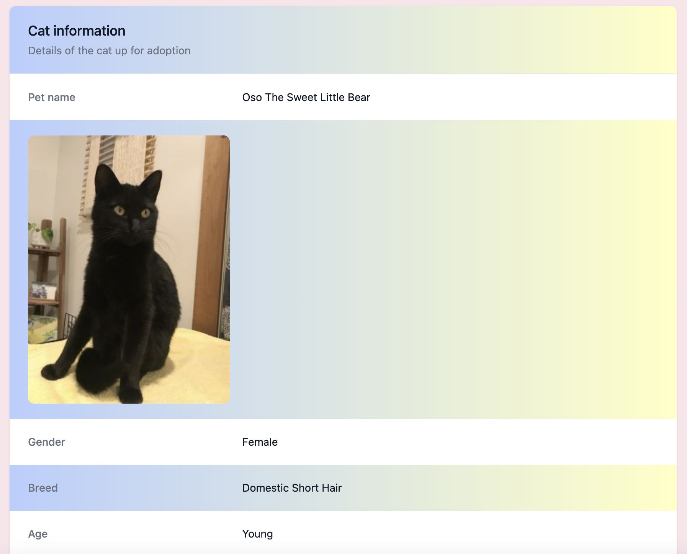

# MeowMatch

## Description

This App is created for both large and small viewports.

The URL of the deployed webpage can be found at:

Here are the screenshots of the webpage:

## Installation

N/A

## Usage

This App is for cat lovers who are looking for a one-stop shop for: looking at cat pictures and GIF's, learning about cats, searching for adoptable cats by zipcode, and browsing cat-oriented nonprofit listings.

## Credits

Development Team:
    Jony Toast: https://github.com/jonytoast  
    Benji Decker: https://github.com/BenjiCCB  
    Fred Wang: https://github.com/FeddericoWayne  

API list:
    Petfiner APi: https://www.petfinder.com/developers  
    CATAAS(Cat as a Service) API: https://cataas.com  
    Cat Facts API: https://catfact.ninja/#/Facts  
    The Cat API: https://developers.thecatapi.com  
    Every.org API: https://www.every.org  

## License

