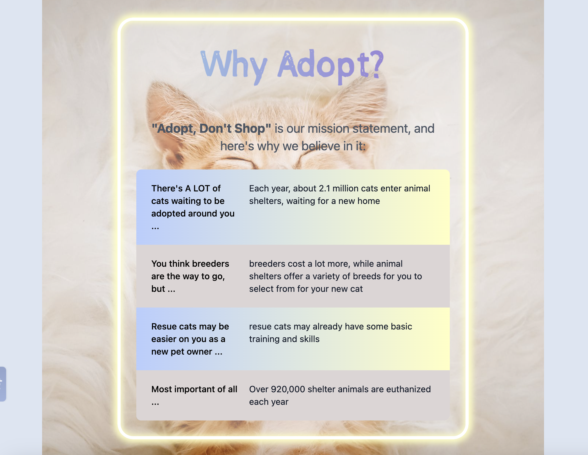

# MeowMatch

## Description

MeowMatch is an app designed to help you find and connect with cats in your area. MeowMatch also allows you to look at cute cat pictures, read random cat facts as well as cat-related charities you can save for later or for possible future donations. 

The "Adopt Today" section functions both as a reminder for users to consider adopting a cat, and as a slideshow that displays random cat images. To dismiss the text inside the slideshow, click on "Maybe Later," and the text box will disappear for you to enjoy unlimited adorable cat pictures. If you click on "Start," you will be taken to the cat-search section of the page, where you'll be instructed on how to generate search results. To find adoptable cats, enter your preferences on cat gender, age, and type in your zipcode, and click "Find Your New Furbaby". If there's any error or missing info from the user input, the user will be prompted to try again. Upon a successul search, the screen will automatically scroll down to display search results, which include the cats' name, image, gender, breed, age, location, contact email and phone number. 

To view cat facts, click on "Daily Meows" in the navigation bar and the page will take you to the cat fact section, where you can click "NEXT" to display the next cat fact, along with a cute cat GIF.

To browse through the list of charities that are dedicated to cat well-being in the country, click on "Donate" in the navigation bar or scroll down to the bottom of the page, and click on "See Nonprofit List." Once the list is displayed, you can click on "Save This Charity" to place a charity in your saved list for future references. To view your saved list, click on "Your Saved list." In the saved list, you can click on "Remove from List," and that charity will be placed back into the original charity list. You can also choose to clear your entire saved list by clicking on "Clear List."  

This App is created for both large and small viewports.

The URL of the deployed webpage can be found at:

Here are the screenshots of the webpage:

## Installation

N/A

## Usage

This App is for cat lovers who are looking for a one-stop shop for: looking at cat pictures and GIF's, learning about cats, searching for adoptable cats by zipcode, and browsing cat-oriented nonprofit listings.

## Credits

Development Team:
    Jony Toast: https://github.com/jonytoast  
    Benji Decker: https://github.com/BenjiCCB  
    Fred Wang: https://github.com/FeddericoWayne  

API list:
    Petfiner APi: https://www.petfinder.com/developers  
    CATAAS(Cat as a Service) API: https://cataas.com  
    Cat Facts API: https://catfact.ninja/#/Facts  
    The Cat API: https://developers.thecatapi.com  
    Every.org API: https://www.every.org  

## License

